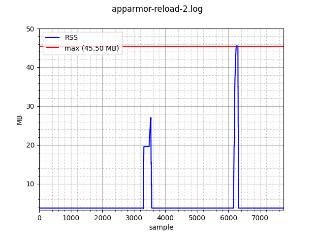

### What

A trivial tool for profiling resource usage of a cgroup by looking at various
controllers.

Right, the tool can only profile the RSS as reported by memory controller.

### Building & dependencies

```
$ cargo build
```

The plotting tool requires numpy and matplotlib to be installed.

### Usage

Collect some data to a log file:

```
$ ./target/debug/cgstat -d 1 system.slice/snapd.service | tee mem.log
2020-12-24T13:54:54.961600656+00:00,36581376
2020-12-24T13:54:55.962096455+00:00,36581376
2020-12-24T13:54:56.963288427+00:00,36581376
...
```

Optionally can plots plot the recorded data like so:



Show a plot of logged RSS values:

```
$ ./plot.py mem.log
```

Or write the plot to a file:

```
$ ./plot.py -o mem-plot.png mem.log
```

### TODO

[ ] support cgroup v2
[ ] configurable memory controller mount point
